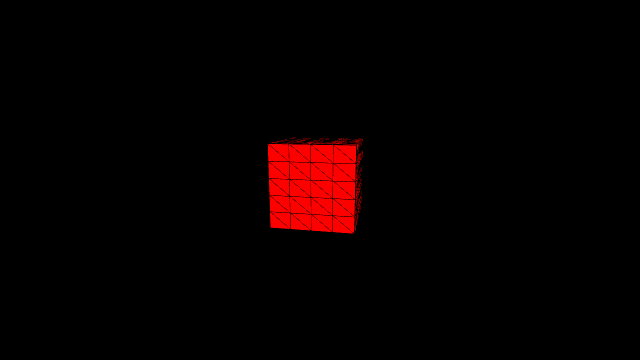
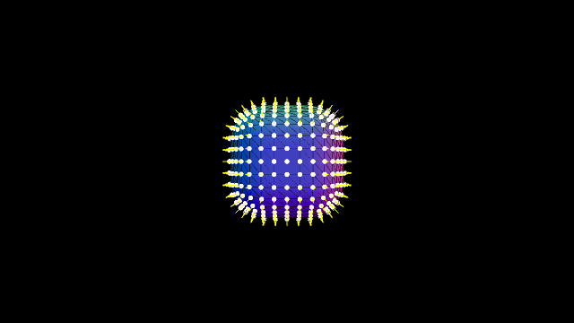
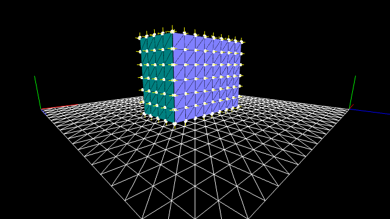
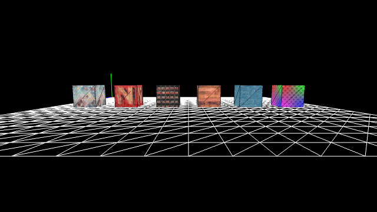
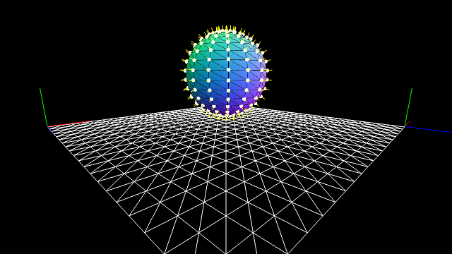
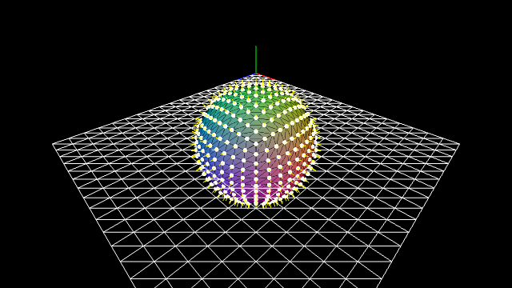
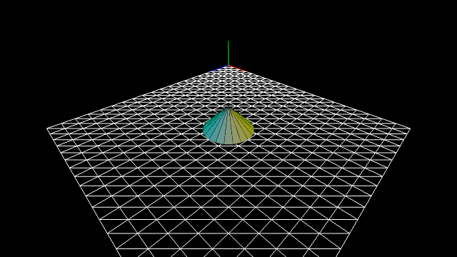
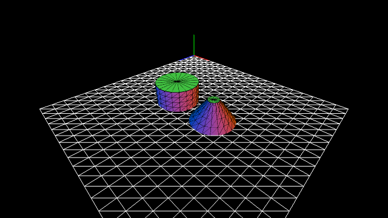

GitHub: [https://github.com/kenjiSpecial/tubugl-3d-shape](https://github.com/kenjiSpecial/tubugl-3d-shape)

### [#00 - procedural cube](./app00/index.html)

[codes](https://github.com/kenjiSpecial/tubugl-3d-shape/blob/master/examples/app00) | [source for ProceduralCube](https://github.com/kenjiSpecial/tubugl-3d-shape/blob/master/src/proceduralRoundingCube.js)

### [#01 - procedural rounding cube](./app01/index.html)

[codes](https://github.com/kenjiSpecial/tubugl-3d-shape/tree/master/examples/app01) | [source for ProceduralRoundingCube](https://github.com/kenjiSpecial/tubugl-3d-shape/blob/master/src/proceduralRoundingCube.js)

### [#02 -  cube](./app02/index.html)

[codes](https://github.com/kenjiSpecial/tubugl-3d-shape/tree/master/examples/app02) | [source for Cube](https://github.com/kenjiSpecial/tubugl-3d-shape/blob/master/src/cube.js)

### [#03 -  texture cubes](./app03/index.html)

[codes](https://github.com/kenjiSpecial/tubugl-3d-shape/tree/master/examples/app03) | [source for TextureCube](https://github.com/kenjiSpecial/tubugl-3d-shape/blob/master/src/textureCube.js)

### [#04 -  sphere](./app04/index.html)

[codes](https://github.com/kenjiSpecial/tubugl-3d-shape/tree/master/examples/app04) | [source for Sphere](https://github.com/kenjiSpecial/tubugl-3d-shape/blob/master/src/sphere.js)

### [#05 -  procedural sphere](./app05/index.html)

[codes](https://github.com/kenjiSpecial/tubugl-3d-shape/tree/master/examples/app05) | [source for ProceduralSphere](https://github.com/kenjiSpecial/tubugl-3d-shape/blob/master/src/proceduralSphere.js)

### [#06 -  cone](./app06/index.html)

[codes](https://github.com/kenjiSpecial/tubugl-3d-shape/tree/master/examples/app06) | [source for Cone](https://github.com/kenjiSpecial/tubugl-3d-shape/blob/master/src/cone.js)

### [#06 -  cylinder](./app07/index.html)

[codes](https://github.com/kenjiSpecial/tubugl-3d-shape/tree/master/examples/app07) | [source for Cylinder](https://github.com/kenjiSpecial/tubugl-3d-shape/blob/master/src/cylinder.js)

all examples were made with [tubugl](https://github.com/kenjiSpecial/tubugl)

